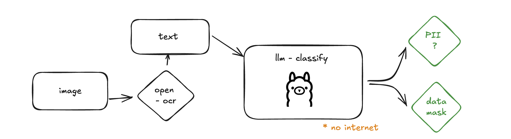

## LLAMA based data-classification




## demo 


### In this repo we are trying to build an intelligent data-classification tool.

1. You want to classify data at hand so you can handle it properly ?
2. You want to mask it so you can use it for your data traning or testing ?

- But you are not willing to pay money to tools like google DLP or opaque like tools which charges you significant amount of money for the data you want to scan and mask.
- the LLM technology in place this can be replaced with small deployment on your machine with ollama installed using llama 3.1 8B model 
- Look at the api we are exposing with api for detectPII and maskPII api's 


Feel free to imporve the prompt we are looking to produce benchmark with accuracy on data-classification and masking tasks.

- Feel free to use this tool and give us feedback.
- contact devyeshvant@gmail.com for clarification or you have ideas to improve create issues on the repo. 

- Open up a PR I will review and merge. Make sure to explain if you add a feature on the API.

Thank you. :)


### install ollama 
https://ollama.com/download 

### setup venv on your local for python and deppendency

### lanchain structured output
https://python.langchain.com/v0.2/api_reference/index.html


### Instructions

1. Install OLLAMA on your machine or use docker image and expose the port (I was not able to get the docker working by the way :))
2. Install python 3.x on your machine
3. Install dependency using pip
    ```sh
    pip install langchain
    pip install google-cloud-dlp # optional 
    pip install fastapi-cors
    pip install fastapi uvicorn
    ```
4. run app by running 
    ```sh
    uvicorn main:app --reload
    ```